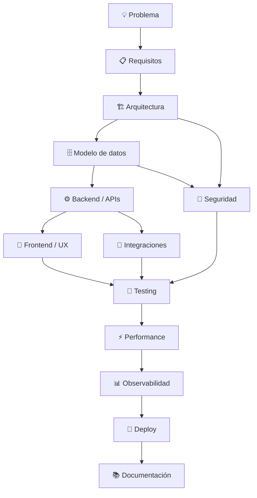

<div align="center">

# 👋 Adán Trinidad

<a href="https://github.com/atrinidad1">
  
</a>

<br>

<p>
  <a href="https://github.com/atrinidad1">
    
  </a>
  <a href="https://cyberdev.qzz.io/">
    
  </a>
  <a href="https://www.linkedin.com/in/adantrinidad">
    
  </a>
  <a href="mailto:adan.tt3@gmail.com">
    
  </a>
</p>

<p>
  
  
  
  
</p>

</div>

---

## 👨‍💻 Perfil profesional

Soy **Técnico egresado en Análisis de Sistemas** con experiencia práctica en **desarrollo de software, soporte de infraestructura TI y administración de entornos Windows/Linux**.

Mi perfil combina dos áreas que considero complementarias:

<table>
<tr>
<td width="50%" valign="top">

### 💻 Software Engineering

- Desarrollo Full Stack
- Backend y APIs
- Arquitectura de aplicaciones
- Bases de datos SQL/NoSQL
- Automatización e IA
- Testing y documentación

</td>
<td width="50%" valign="top">

### 🖥️ Systems & IT

- Windows / Linux
- Soporte a usuarios
- Diagnóstico técnico
- Administración de sistemas
- Automatización de tareas
- Rendimiento y monitoreo

</td>
</tr>
</table>

> Me interesa construir soluciones que sean **claras, seguras, mantenibles y útiles en entornos reales**.

---

# 🧩 Stack tecnológico

<div align="center">

### 🎨 Frontend


<br>

### ⚙️ Backend & APIs


<br>

### 🗄️ Data & Backend Services


<br>

### 📱 Mobile


<br>

### 🪟 Systems & Desktop


<br>

### 🛠️ DevOps & Tooling


</div>

<br>

<div align="center">


</div>

<details>
<summary><b>📚 Ver tecnologías y áreas adicionales</b></summary>

<br>

| | Área | Tecnologías / conceptos |
|:---:|---|---|
| 🌐 | **Frontend** | `HTML5` · `CSS3` · `JavaScript` · `TypeScript` · `React` · `Next.js` · `Svelte` · `Vue` · `Tailwind CSS` |
| ⚙️ | **Backend** | `Node.js` · `Express` · `Python` · `FastAPI` · `PHP` · `C#` · `.NET` |
| 🔌 | **APIs & Realtime** | `REST APIs` · `WebSockets` · `Socket.IO` · `HTTP/SSE` · `MCP` |
| 🤖 | **AI & Automation** | `AI Agents` · `Computer Use` · `Tool Calling` · `OpenCV` · `Workflow Automation` |
| 🗄️ | **Data** | `PostgreSQL` · `Supabase` · `MySQL` · `SQL Server` · `MongoDB` · `Redis` · `Firebase` |
| 🔐 | **Security** | `RBAC` · `RLS` · `Authentication` · `Authorization` · `Least Privilege` |
| 📱 | **Mobile** | `Android` · `Kotlin` · `Jetpack Compose` · `Flutter` · `Dart` |
| 🪟 | **Windows** | `WinUI 3` · `MVVM` · `Win32` · `P/Invoke` · `PDH` · `Windows APIs` |
| 🐧 | **Systems** | `Windows` · `Linux` · `PowerShell` · `Troubleshooting` · `IT Support` |
| 🧪 | **Quality** | `Testing` · `Benchmarking` · `Refactoring` · `Technical Documentation` |
| 🚀 | **DevOps** | `Git` · `GitHub` · `GitHub Actions` · `Docker` · `CI/CD` |

</details>

---

# 🚀 Proyectos técnicos destacados

> Parte de mi trabajo técnico público se encuentra distribuido entre repositorios y perfiles de desarrollo.

### 🖥️ [Real-Time Desktop Agent](https://github.com/Adan0423/real-time-desktop-agent)

> Runtime de **Computer Use / Desktop Vision para Windows 11**, diseñado para permitir que agentes de IA observen e interactúen con aplicaciones de escritorio en tiempo real.

<p>
  
  
  
  
  
  
</p>

- 👁️ Percepción de escritorio en tiempo real.
- ⚡ Interacción nativa con mouse y teclado.
- 🧠 Sesiones persistentes para agentes de IA.
- 🔌 Integración MCP, REST y WebSocket.
- 🧪 Benchmarking y pruebas automatizadas.

<p>
  <a href="https://github.com/Adan0423/real-time-desktop-agent">
    
  </a>
</p>

---

### ⚡ [MemoraX](https://github.com/Adan0423/MemoraX)

> Aplicación nativa para **Windows 11** orientada a visualizar y gestionar memoria Standby y métricas de hardware.

<p>
  
  
  
  
  
</p>

- 💾 Monitorización de memoria.
- 🧹 Gestión de Standby Memory.
- 🌡️ Métricas de CPU/GPU.
- 🪟 Widget flotante Always-On-Top.
- 🔧 Integración con APIs nativas de Windows.

<p>
  <a href="https://github.com/Adan0423/MemoraX">
    
  </a>
</p>

---

### 🧰 [Developer Toolkit Skills](https://github.com/Adan0423/dev-toolkit-skills)

> Colección modular de **skills, prompts y workflows para agentes de IA** aplicados al ciclo de desarrollo de software.

<p>
  
  
  
  
  
</p>

Áreas cubiertas: arquitectura, bases de datos, seguridad, UI/UX, documentación, automatización y desarrollo asistido por agentes.

<p>
  <a href="https://github.com/Adan0423/dev-toolkit-skills">
    
  </a>
</p>

---

# 🏗️ Cómo abordo un sistema



### Principios

- 🏗️ **Arquitectura:** responsabilidades claras y bajo acoplamiento.
- 🗄️ **Datos:** relaciones justificadas, integridad y consultas eficientes.
- 🔐 **Seguridad:** mínimo privilegio y validación de permisos.
- ⚡ **Rendimiento:** medir primero y optimizar después.
- 📱 **UX:** interfaces responsive para distintos dispositivos.
- 🧪 **Calidad:** testing, documentación y refactoring continuo.

---

# 📌 Experiencia práctica

- 🌐 Desarrollo de aplicaciones web y sistemas Full Stack.
- 🗄️ Diseño y optimización de bases de datos relacionales.
- 🔐 Implementación de permisos mediante **RBAC, RLS y funciones SQL**.
- 🪟 Desarrollo y experimentación con **Windows APIs, .NET y Win32**.
- 🐧 Soporte y administración de entornos **Windows/Linux**.
- 🤖 Integración de **IA, MCP, automatización y agentes** en proyectos de software.
- 🧪 Refactorización, documentación técnica, testing y optimización de rendimiento.

---

# 🔬 Actualmente profundizando en

```yaml
software_engineering:
  - scalable architecture
  - backend performance
  - application security
  - testing & observability

ai_and_automation:
  - Model Context Protocol
  - AI agents
  - Computer Use
  - tool integrations

data:
  - PostgreSQL
  - Supabase
  - RBAC / RLS
  - query optimization

systems:
  - Windows internals
  - Linux administration
  - automation
  - performance monitoring
```

---

# 📊 Actividad en GitHub

<div align="center">


<br>


</div>

> [!NOTE]
> Esta sección refleja únicamente la actividad pública asociada a **@atrinidad1**. Parte de los proyectos técnicos enlazados arriba se mantiene en otros repositorios de desarrollo.

---

# 🎯 Enfoque profesional

<table>
<tr>
<td width="50%" valign="top">

### 💼 Roles de interés

- Full Stack Developer
- Software Developer
- Backend Developer
- Systems / IT Support
- Prácticas profesionales en TI

</td>
<td width="50%" valign="top">

### 🤝 Áreas de interés

- Software Engineering
- AI & Automation
- Backend & APIs
- Data Architecture
- Windows Development
- Infrastructure & Systems

</td>
</tr>
</table>

**Modalidad:** presencial · híbrida · remota  
**Ubicación:** Perú 🇵🇪

---

# 📫 Contacto

<div align="center">

### ¿Tienes una oportunidad, proyecto o colaboración?

<br>

<a href="mailto:adan.tt3@gmail.com">
  
</a>
<a href="https://www.linkedin.com/in/adantrinidad">
  
</a>
<a href="https://cyberdev.qzz.io/">
  
</a>
<a href="https://github.com/atrinidad1">
  
</a>

<br><br>


<br><br>

<sub>Actualizado: agosto de 2026</sub>

</div>
